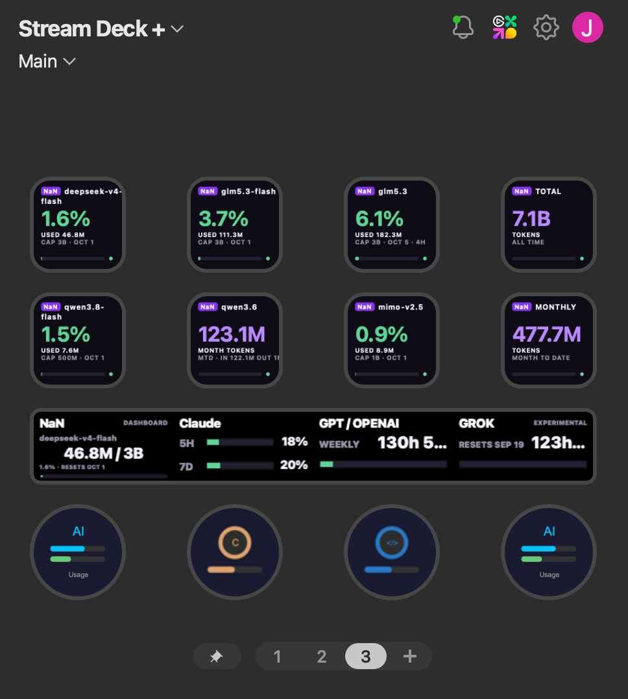
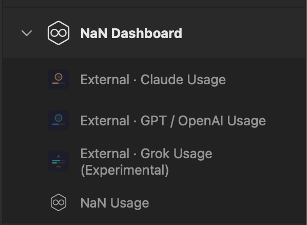
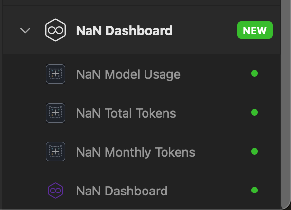

# NaN Dashboard for Stream Deck and Stream Deck+

See your NaN account's usage limits and model usage on Stream Deck and Stream Deck+. Keypad buttons work on both devices; dials require Stream Deck+. Optional integrations also show usage from Claude Code, Codex, and experimental Grok.

## Overview

<p align="center">
  
</p>
<p align="center"><em>NaN Dashboard in the Stream Deck+ app. Usage shown is an example and varies by account.</em></p>

## Primary Features

- **NaN Dashboard quota:** explicitly import an authenticated Chrome session from NaN Usage, NaN Model Usage, NaN Total Tokens, or NaN Monthly Tokens, then view quota, reset windows, and safe stale-state feedback.
- **NaN actions:** use a keypad launcher, per-model usage, all-time tokens, or month-to-date tokens without exposing session data in settings.
- **External CLI dials:** optionally view local Claude Code, Codex, and experimental Grok Build usage through their installed, signed-in CLIs.

## Install on Your Mac

**You do not need to download the source code, install Node.js or pnpm, or use Terminal.** Download the installer, confirm installation in Stream Deck, then connect your NaN session as described below.

### Before you start

- A Mac running **macOS 13 or later**. Windows and Linux are not supported.
- The **Elgato Stream Deck app, version 7.1 or later**, installed on your Mac.
- A Stream Deck device with a free action position. **NaN Usage** requires Stream Deck+, while **NaN Model Usage**, **NaN Total Tokens**, and **NaN Monthly Tokens** can import a session from a regular keypad key on supported Stream Deck devices.
- **Google Chrome**, signed in to your NaN account with your NaN dashboard open.

### 1. Download the installer

[**Download the latest macOS installer**](https://github.com/refactor-ia/streamdeck-nan/releases/latest/download/com.refactor-ia.nan.streamDeckPlugin)

The file is named **`com.refactor-ia.nan.streamDeckPlugin`**.

Alternatively, open the [latest release](https://github.com/refactor-ia/streamdeck-nan/releases/latest), expand **Assets**, and select that file. Do **not** download **Source code (zip)** or **Source code (tar.gz)** to install the plugin. `SHA256SUMS` is an optional download for verifying file integrity, not an installer.

### 2. Install it in Stream Deck

1. Open the downloaded `com.refactor-ia.nan.streamDeckPlugin` file, usually in your **Downloads** folder.
2. Stream Deck should open. Confirm its installation or update prompt.
3. Look for the **NaN** actions in the action list in Stream Deck.

The plugin is installed, but it still needs access to your NaN session before it can display usage or list models.

> **macOS security notice:** this plugin is distributed without Apple signing or notarization. If macOS blocks installation, stop and [report the exact message](https://github.com/refactor-ia/streamdeck-nan/issues). Do not disable system security protections. Opening the download alone does not mean installation has completed: confirm the Stream Deck prompt.

### 3. Connect your NaN account

1. In **Google Chrome**, make sure you are signed in to NaN and can view your dashboard.
2. In the **Stream Deck app**, drag **NaN Usage**, **NaN Model Usage**, **NaN Total Tokens**, or **NaN Monthly Tokens** onto a compatible position.
3. Select that action in the app. In its configuration panel, click **Import session from Chrome**.
4. Wait for usage data to appear. Touch the NaN Usage dial or press a keypad action to refresh it.

You do not need to copy a cookie, token, or API key. Session import happens only when you request it; installing the plugin does not automatically sign you in. The configuration panel disables **Import session from Chrome** while it waits, then shows a safe success, retry, or already-in-progress message. If it is still waiting after two minutes, the panel lets you retry; that message does not cancel the import already running in the plugin.

<p align="center">
  
</p>
<p align="center"><em>NaN dial actions are available on Stream Deck+.</em></p>

### 4. Add a model button

1. Drag **NaN Model Usage** onto a regular key position in the Stream Deck app.
2. Select the new key and click **Refresh models** in its configuration panel.
3. Choose a model from the **Model** dropdown. The list comes from your NaN account, so connect your session first.
4. Press the physical key to refresh its usage.

You can also add **NaN Total Tokens** or **NaN Monthly Tokens** to regular keys. **NaN Dashboard** only opens the dashboard in your browser; it does not connect your session or load usage data.

<p align="center">
  
</p>
<p align="center"><em>NaN keypad actions work on both Stream Deck and Stream Deck+.</em></p>

### Updating an existing installation

Download and open the latest installer, then confirm the update in Stream Deck. Updating from **v1.0.4 to v1.0.5** keeps the same action identifiers; you do not need to recreate those buttons or delete your saved NaN session for this fix.

If you are upgrading from **v1.0.3 or earlier**, add the new actions again: v1.0.4 changed the plugin identity to Refactor IA. Old button placements are not migrated.

### If something does not work

- **The model list is empty:** first import a session from the configuration panel of **NaN Usage**, **NaN Model Usage**, **NaN Total Tokens**, or **NaN Monthly Tokens**. If the session is already connected, click **Refresh models** on the model button instead of importing it again. Installing the plugin or opening the dashboard alone is not enough.
- **The import button does nothing, or Stream Deck says the plugin is unstable:** make sure you installed **v1.0.5 or later**. Earlier standalone packages omitted a required runtime dependency; v1.0.5 fixes that startup problem.
- **It still does not work:** [open an issue](https://github.com/refactor-ia/streamdeck-nan/issues) with your plugin, macOS, and Stream Deck app versions, the action you selected, and any visible error message. Never include cookies, tokens, passwords, or private account data.

Keep the saved session unless there is a specific reason to replace it; an empty model list alone does not identify the cause.

### Dashboard recovery

In published **v1.0.7**, the selected action's configuration panel has no import progress or result feedback. On `main` (for an upcoming release), it will show the feedback below. In either version, an import starts only when you explicitly click **Import session from Chrome**.

**Dial recovery vocabulary** — **NaN Usage** on Stream Deck+ is the dial; keypad actions do not expose its full status vocabulary.

| Where and message | What to do |
| --- | --- |
| NaN Usage dial — **IMPORT SESSION** | Select **NaN Usage** on a dial or one of the three supported data-display keypad actions described above, then explicitly click **Import session from Chrome** in its configuration panel. |
| NaN Usage dial — **IMPORT BUSY** | Wait for the current import to finish, then refresh or retry. Do not start concurrent imports. |
| NaN Usage dial — **IMPORT UNAVAILABLE** | Try the explicit import once more from the configuration panel. If it remains unavailable, report the visible message and versions; this message does not identify a specific browser condition. |
| NaN Usage dial — **KEYCHAIN UNAVAILABLE** | Allow the applicable macOS Keychain permission when prompted, then retry. Do not disable macOS security or delete credentials to work around it. |
| NaN Usage dial — **SESSION RESET FAILED** | Retry the refresh or explicit import. If it persists, report it; do not delete credentials as a repair step. |
| NaN Usage dial — **QUOTA INVALID** | Refresh once. If it remains, report it as a dashboard-response/schema problem rather than reimporting or repairing credentials. |
| NaN Usage dial — **DASHBOARD UNAVAILABLE** | Refresh later. A temporary dashboard failure can be retried. |
| NaN Usage dial — **STALE** | The displayed quota is a previous value, not current data. Refresh before relying on it. |
| NaN Total Tokens or NaN Monthly Tokens key — **METRICS ERROR** | Refresh later. Quota data can still be valid when metrics are unavailable. |
| NaN Model Usage key — combined **NOT RETURNED** / **NO DATA** display | Click **Refresh models**, then select a model returned by the list. |
| Keypad action — **NO DATA** or **DASHBOARD OFFLINE** | These messages can combine several underlying conditions and do not uniquely diagnose the problem. Use the relevant recovery step above or report the visible message. |

**Upcoming property-inspector feedback** — While an import is pending, its button is disabled.

| Visible message | Meaning and next step |
| --- | --- |
| Importing session from Chrome. Please wait. | The requested import is pending. |
| Session imported. Usage will refresh shortly. | The session was imported. |
| Import could not be completed. Check Chrome, then try again. | Retry after checking Chrome. |
| Another import is already in progress. Please wait and try again. | Wait, then try again. |
| Still waiting for the plugin. You can retry when ready. | The two-minute inspector watchdog has elapsed; it does not cancel any backend import. |
| Unable to contact the plugin. Reopen this action and try again. | Reopen this action, then try again. |
| Connection closed. Reopen this action to try again. | Reopen this action, then try again. |

When reporting an issue, include the plugin and Stream Deck versions, the action, and the visible message. Do not include cookies, tokens, passwords, account data, or raw diagnostics.

## External Integrations and Requirements

- **Claude Usage** requires Claude Code installed and signed in at `$HOME/.local/bin/claude`, `/opt/homebrew/bin/claude`, `/usr/local/bin/claude`, or `/usr/bin/claude`. It runs the official Claude CLI `/usage` command with tools disabled, then shows its session and weekly usage windows. The command must report zero turns, API duration, cost, and token usage.
- **GPT / OpenAI Usage** requires Codex CLI installed, signed in, and available as `codex` to Stream Deck. It starts one local `codex app-server`, reuses the Codex CLI session, and shows the weekly usage window returned by Codex.
- **Grok Usage (EXPERIMENTAL)** requires the optional Grok Build CLI installed and signed in. It starts the authenticated local Grok Build CLI over ACP stdio and requests only its `x.ai/billing` extension. It does not read credential files or API keys, send prompts, or invoke inference.

Touching an external encoder refreshes its data. Pressing a Claude or Codex encoder opens the corresponding provider page; Grok refreshes on touch.

## Development

Development requires Node.js 24 and pnpm 11.13.0.

Install dependencies:

```sh
pnpm install --frozen-lockfile
```

Validate TypeScript and the Stream Deck manifest:

```sh
pnpm check
```

Run the full test suite:

```sh
pnpm test:workspace
```

Build the plugin bundle:

```sh
pnpm build
```

The packaging script invokes the repository-local installed Stream Deck CLI entry
(`node_modules/@elgato/cli/bin/streamdeck.mjs`) directly; it never runs pnpm,
npm, or npx. A later authorized disposable isolated copy must expose its complete
installed `node_modules` tree at that same repository-relative path (for example,
through a read-only mount or link); the script does not install or download dependencies.

Watch source files and restart the plugin after each build:

```sh
pnpm watch
```

## Security and Privacy

The plugin reuses existing local sessions; it does not provide a login flow or
store credentials in Stream Deck settings. Claude authentication remains inside
the installed Claude CLI. The plugin runs only its built-in `/usage` command
without tools or model inference and accepts only bounded JSON with affirmative
zero-inference telemetry and the two expected usage lines. It does not read
Claude credentials or call a private usage endpoint. Claude discovery uses only
the four absolute launcher paths listed under Requirements, resolves symlinks,
and checks target identity, ownership, permissions, and parent directories
again immediately before execution. Codex and Grok use the same trusted
absolute-candidate, symlink-resolution, and pre-spawn identity-validation
controls. The final validated-path-to-spawn interval is a same-user filesystem
residual shared by these CLI launches; it is not an atomic execution guarantee.
Codex authentication remains inside the local Codex CLI and its app server.
Experimental Grok authentication also remains inside the local Grok Build CLI;
the plugin sends only ACP initialization and billing requests. Dashboard session
cache data is stored through the dedicated local session store, never in Stream Deck
settings. The Chrome importer is invoked only by the inspector button, validates one
profile/store candidate at a time, and does not expose cookies, provider URLs, or
Safe Storage secrets in settings, feedback, or logs.

Tokens, authorization headers, raw provider payloads, and CLI diagnostics are
not written to logs, settings, action feedback, or the property inspector. Usage
requests go directly through the official provider sessions, with no third-party
relay.

### Reporting Security Issues

If you discover a security vulnerability, please report it privately. See
[SECURITY.md](SECURITY.md) for details. Our data-handling practices are
described in [PRIVACY.md](PRIVACY.md).

## Advanced Architecture and Status

The `com.refactor-ia.nan` migration recreates all eight Stream Deck buttons, so users add the new actions again after installing version 1.0.4. Existing NaN session compatibility is retained internally only; this documentation does not expose session or credential identities.

The generated, tracked bundle at `com.refactor-ia.nan.sdPlugin/bin/plugin.js` keeps the plugin directory self-contained.

### Dashboard Behavior Details

The NaN Usage dial and the NaN Model Usage, NaN Total Tokens, and NaN Monthly Tokens keys read dashboard data from the explicitly imported authenticated Chrome session. The plugin never reads Chrome or Chrome Safe Storage during appearance, refresh, rotation, settings, or wake handling. Import occurs only after an explicit configuration-panel click on one of those four actions. Dashboard values show provider quota (`used / cap`), raw percentage, and the API-provided reset or rolling window. A saved `legacy` source is migrated to `dashboard` once when its dial appears; all other settings and model IDs are preserved verbatim. Touching the dial refreshes its data; rotating it selects an API-returned capped model. **NaN Model Usage** selects one API-returned capped or uncapped model per key and refreshes the shared dashboard snapshot when pressed. A transient dashboard failure keeps only the last dashboard quota as `STALE`; a rejected session returns to import onboarding without showing a prior account's quota.

### NaN Dashboard Validation Status

The direct dashboard flow has focused mocked tests only. It still requires human
validation with a real authenticated Chrome profile and normal macOS permission
prompts, followed by the project's release-process validation. This checkout does not
claim production readiness, perform signing, restart Stream Deck, or deploy the
plugin.

### Platform Support

The current manifest supports macOS only. Encoder actions target Stream Deck+;
NaN Model Usage, NaN Total Tokens, NaN Monthly Tokens, and NaN Dashboard are also available as standard keypad actions.

## Contributing

Contributions are welcome! Please read [CONTRIBUTING.md](CONTRIBUTING.md) for guidelines.

## License

This project is licensed under the MIT License. See [LICENSE](LICENSE) for details.
